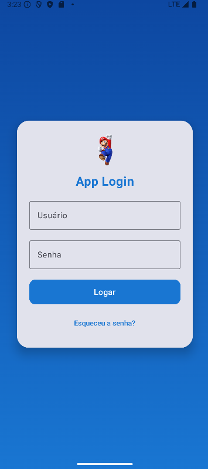
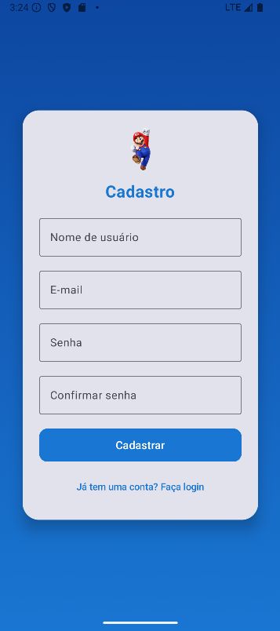
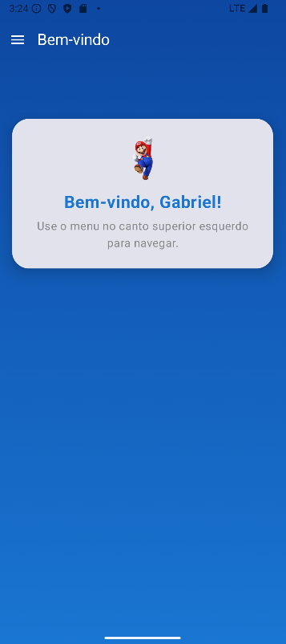
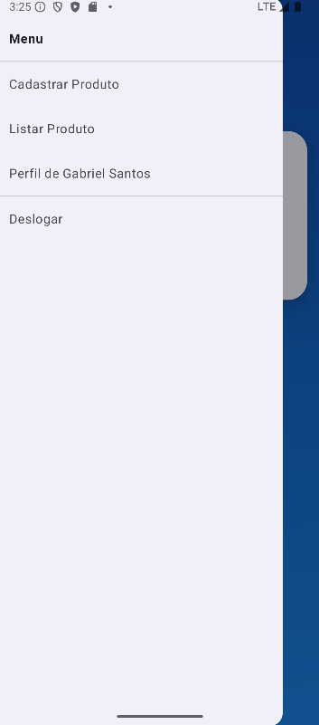

# 📱 App Login - Jetpack Compose

Este é um projeto Android desenvolvido com **Jetpack Compose** que simula um sistema de login, cadastro de produtos e navegação com menu lateral. Ele foi feito com foco em UI moderna utilizando os componentes do **Material 3**.

---

## 🛠️ Funcionalidades

- Tela de **Login**
- Tela de **Cadastro**
- Tela Home com saudação personalizada
- Navegação via **Drawer** (menu lateral)
  - **Cadastrar Produto**
  - **Listar Produtos**
  - **Perfil do Usuário**
  - **Deslogar**

---

## 🚀 Tecnologias Utilizadas

- [Jetpack Compose](https://developer.android.com/jetpack/compose)
- [Material 3](https://m3.material.io/)
- [Navigation Compose](https://developer.android.com/jetpack/compose/navigation)
- Kotlin (Android)

---

## 📸 Prints do App

### 🖼️ Tela de Login


---

### 🖼️ Tela de Cadastro de Usuário


---

### 🖼️ Menu Lateral + Home



---

## ▶️ Como Executar

1. Clone o repositório:
   ```bash
   git clone https://github.com/seu-usuario/seu-repositorio.git

2.Abra o projeto no Android Studio.

3.Execute em um emulador ou dispositivo físico com Android 5.0 (API 21) ou superior.

### Estrutura de Navegação

*MainActivity: gerencia a navegação principal.
*LoginScreen: tela inicial para autenticação.
*RegisterScreen: cadastro de novo usuário.
*HomeScreen: interface principal com menu lateral.
*CadastrarScreen e ListarProdutosScreen: telas internas da Home.
*PerfilScreen: mostra dados do usuário.


